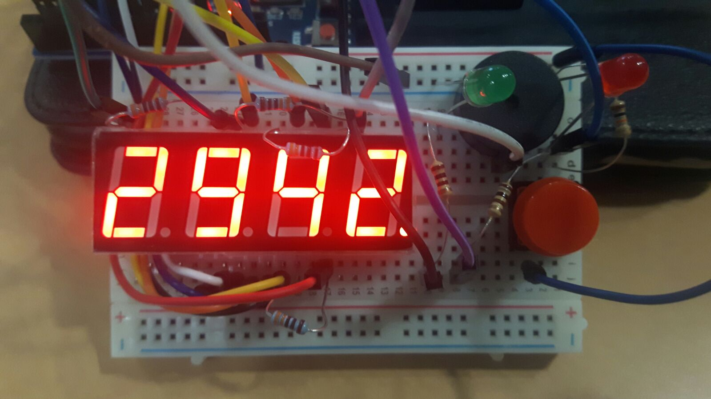
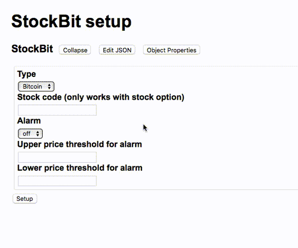
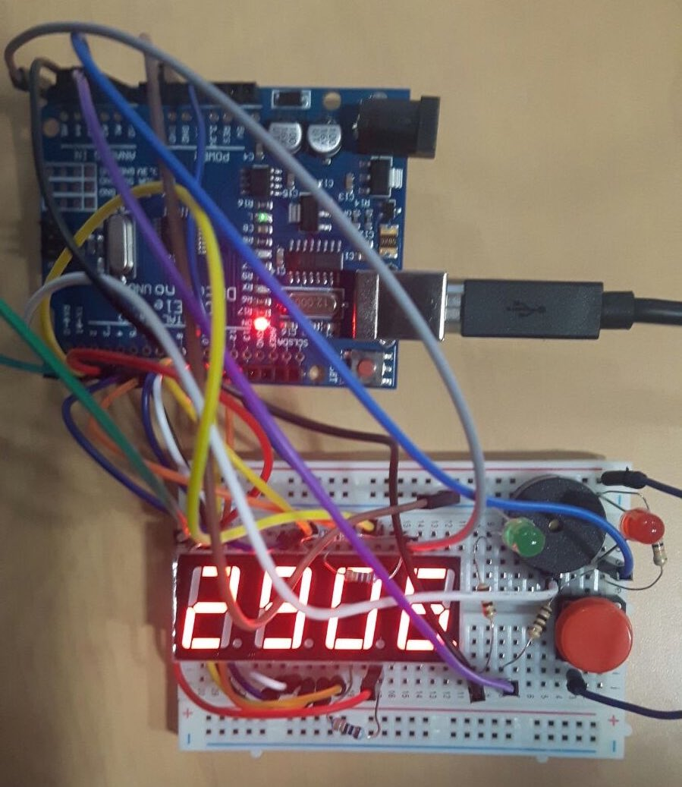

# StockBit - display stock exchange or Bitcoin prices in real time!

Challenge \#12 at the UCL PPC Hackathon - Team 7

Current stock exchange price of a chosen company or the bitcoin rate is displayed on a 4-digit 7-segment LED display, driven by an Arduino (actually a DCcduino), connected serially to a PC/Mac with a python app getting the data from the Web.

<!----->
 

### What does it do

The device consists of a 4 digit display, with two LEDs (red and green), a buzzer and a button. These are controlled by an Arduino microcontroller board, connected to a computer with a USB cable. The display shows the current price of bitcoin in US dollars (actually, the [Bitcoin Price Index](http://www.coindesk.com/price/bitcoin-price-index/), which is an average from several exchanges) or the price of a chosen stock share from NYSE, NASDAQ and other main exchanges.
For stock prices, the LED color indicates whether the current price is above (green) or below (red) the last opening price.

The information is fetched and sent to the device by a script running constantly on the computer and controlled by a settings file.
A web-based GUI allows to change those settings in real time, adjusting the display.

The GUI makes it possible to set an alarm, which will go off when the price crosses the upper or lower threshold values. When this happens, the buzzer will start beeping, and the display and an appropriate LED blinking, until the button is pressed.

### How does it work

The display, LEDs, buzzer and the button are controlled by the Arduino. The display uses 12 pins (8 for the segments and 4 for the digit gates) and is multiplexed. Because the current limiting resistors are connected to the digit pins, the multiplexing iterates over segments, not digits. This is handled by the [SevSeg](https://github.com/DeanIsMe/SevSeg) library.

<!--  -->
 

The Arduino code keeps track of the current state - what number to display (including the placing of the decimal dot), which LEDs are on and whether the alarm is on or not. The communication with the computer is realised by a serial interface, with all information passed and read out byte by byte. Simple commands (switch red LED on, alarm state on) are passed as single ASCII characters, while the number to display is sent as a 6-character command: one symbol to reset the display, followed by four digits and the decimal placing.

On the computer, a python script runs in an infinite loop; every 3 seconds it fetches the latest price and sends it to the Arduino, checking if the alarm should be triggered and what colour LED should be on.
The share prices come from the [googlefinance](https://github.com/hongtaocai/googlefinance) module, which uses the Google Finance API. The Bitcoin Price Index is provided by the [CoinDesk API](http://www.coindesk.com/price/).

The object of interest and alarm levels are stored in a JSON-formatted settings file, which can be edited while the main script is running.
The GUI to do this conveniently is a simple website with a form, generated by the [JSON editor](https://github.com/jdorn/json-editor). The page is served by a simple local python server, which accepts the output of the form as a JSON object via the POST method and saves it as the setup file.

### How to run it

First you have to get an Arduino Uno (or the Chinese knock-off) and necessary components: breadboard, 4 digit 7seg display, a button, two LEDs, a buzzer, 4 330Ohm and 3 100Ohm resistors, and a bunch of wires. A diagram might be added in the future, but the photo and the arduino source code should be enough to figure out the connections.

Using the [Arduino IDE](https://www.arduino.cc/en/main/software), upload the `arduino/display_test.ino` code to the board. Leave it connected via the USB cable, which is necessary for the serial connection (and power).

Run the `python realTime.py` script in a terminal session or in the background (mind that currently it prints a lot of output). It should automatically detect the serial port for communicating with the Arduino, but this is only implemented for Linux and OS X; look at the code in `arduino_comm.py` if you're using Windows.

The first time, the script will crash because there is no setup file (`setupfile.json`).
Run `python setup.py` to create one with some default values. You can use this script with command line arguments to change the settings (e.g. `python setup.py --Type Bitcoin` or `python setup.py --Type Stock --Stock NVDA --Alarm on --LLim 130`) or edit `setupfile.json` manually. Note that the script is work in progress and may have some unexpected effects.

To use a more intuitive visual interface for modifying the setup file, start the python server with `python setup_server.py 3000` (the last number is the port, which can be any value). It is wise to enable firewall prohibiting incoming connections, since the server script is hacked together and not necessarily secure. In a browser window, navigate to `localhost:3000`. You should see the form allowing you to set the type of display ('Demo' loops through a range of dummy values), the stock code and alarm settings. Pressing the 'Submit' button will make the server create a new setup file with the chosen values and the Arduino display will react with the next update.

### How to install missing packages

Type `pip install -r requirements.txt` to install the python packages.

Turns out that we need the latest development version of `googlefinance`, so follow instructions [from here](https://github.com/hongtaocai/googlefinance) to install it from a git clone (clone it somewhere outside the data\_tracker directory)
